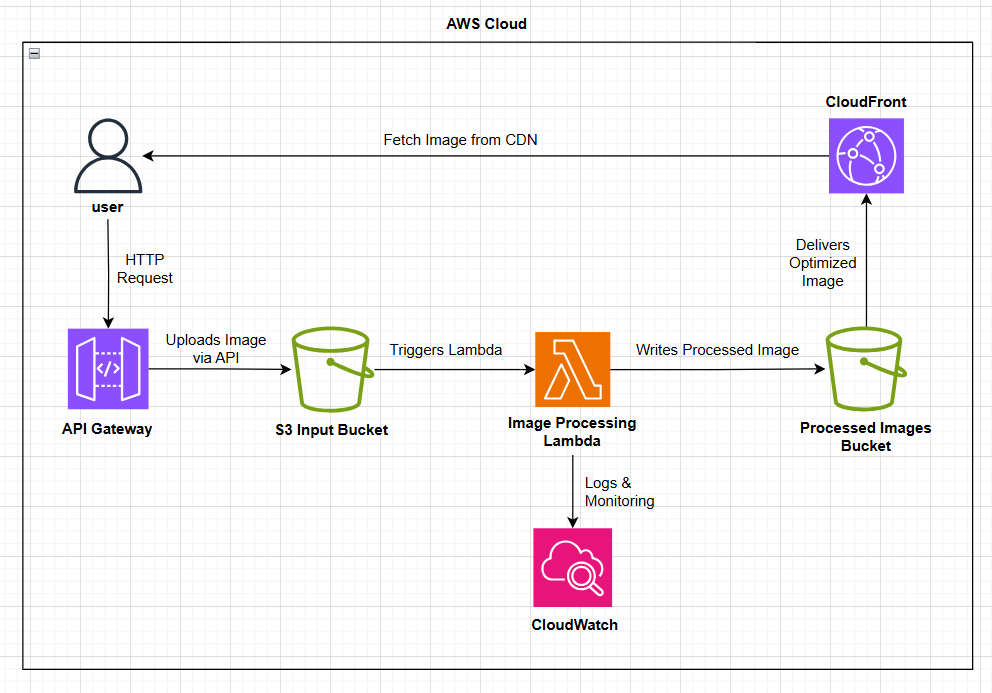

<div align="center">

# 🖼️ Serverless Event-Driven Image Processing Pipeline


<br/><br/>

> **A real-time, event-driven serverless image processing architecture built on AWS. Automatically ingests, resizes, and optimizes images via S3 Object-Created events and AWS Lambda, distributing optimized outputs globally through Amazon CloudFront.**

</div>

---

## 📌 Architecture Overview

This project implements an automated, scalable media processing pipeline using native cloud services:

1. **Client Upload:** Users upload source images via an Amazon API Gateway REST endpoint directly into the landing S3 input bucket.
2. **Event Trigger:** The `s3:ObjectCreated:*` event immediately invokes an AWS Lambda function asynchronously.
3. **Image Transformation:** The Lambda function (Python + Pillow) downloads the raw buffer, performs image resizing and compression, and writes the output.
4. **Optimized Storage:** The processed asset is stored inside a separate, dedicated S3 output bucket.
5. **Global Delivery:** Processed images are served with low latency to end-users via Amazon CloudFront edge caches.

---

## 📸 Architecture Diagram

<p align="center">
  
</p>

---

## 🛠️ AWS Services & Tech Stack

| Service / Tool | Role in Architecture |
|---|---|
| **Amazon S3 (Input)** | Staging bucket receiving raw user image uploads |
| **Amazon S3 (Output)** | Production bucket storing resized and optimized images |
| **AWS Lambda** | Serverless execution engine running Python image manipulation |
| **Python & Pillow** | Fast image processing library bundled into Lambda deployment package |
| **Amazon API Gateway** | Public REST interface handling image upload requests |
| **Amazon CloudFront** | High-speed global CDN caching processed assets |
| **Amazon CloudWatch** | Centralized logging, execution metrics, and error alerting |
| **AWS IAM** | Granular execution roles granting least-privilege bucket access |

---

## ⚙️ Event-Driven Processing Lifecycle

```
[ User ]
   │
   ▼ (Upload Image)
[ API Gateway ]
   │
   ▼
[ S3 Input Bucket ] ──► (s3:ObjectCreated Event) ──► [ AWS Lambda ]
                                                            │
                                                            ├── Resize & Optimize (Pillow)
                                                            ├── Generate Thumbnail
                                                            └── Upload Output
                                                                   │
                                                                   ▼
                                                         [ S3 Output Bucket ]
                                                                   │
                                                                   ▼
                                                         [ CloudFront CDN ]
                                                                   │
                                                                   ▼
                                                            [ End User ]
```

---

## 🚀 Setup & Deployment Guide

### Prerequisites
- Active AWS account with Administrator privileges
- Python 3.9+ and pip installed locally
- AWS CLI configured with active credentials

### Deployment Steps

1. **Provision S3 Buckets:**
   - Create `app-image-input-<unique-id>`
   - Create `app-image-output-<unique-id>`
2. **Package Lambda Artifact:**
   ```bash
   mkdir package
   pip install --target ./package Pillow
   cd package && zip -r ../image_processor.zip .
   cd .. && zip -g image_processor.zip lambda_function.py
   ```
3. **Deploy Lambda & Configure Trigger:**
   - Create Lambda function with Python runtime.
   - Attach IAM role with read permissions on `input` bucket and write permissions on `output` bucket.
   - Add S3 event notification triggering on all object creation events (`.jpg`, `.png`).
4. **Configure CloudFront & API Gateway:**
   - Link CloudFront distribution origin to the `output` bucket.
   - Deploy API Gateway endpoint to forward multipart image payloads.

---

## 🔒 Security & Cost Optimization

- **Least-Privilege Security:** Lambda IAM policies restrict access exclusively to the target source and destination buckets.
- **Decoupled Architecture:** Using separate input and output buckets prevents recursive Lambda invocation loops.
- **Pay-Per-Use Model:** Zero operational idle cost; charges apply only during the milliseconds Lambda executes.

---

## 📬 Author & Connect

<div align="center">

**Developed by Rafat Ashraf**  
*Cloud & DevOps Engineer*

[](https://linkedin.com/in/rafat-devops)

</div>
