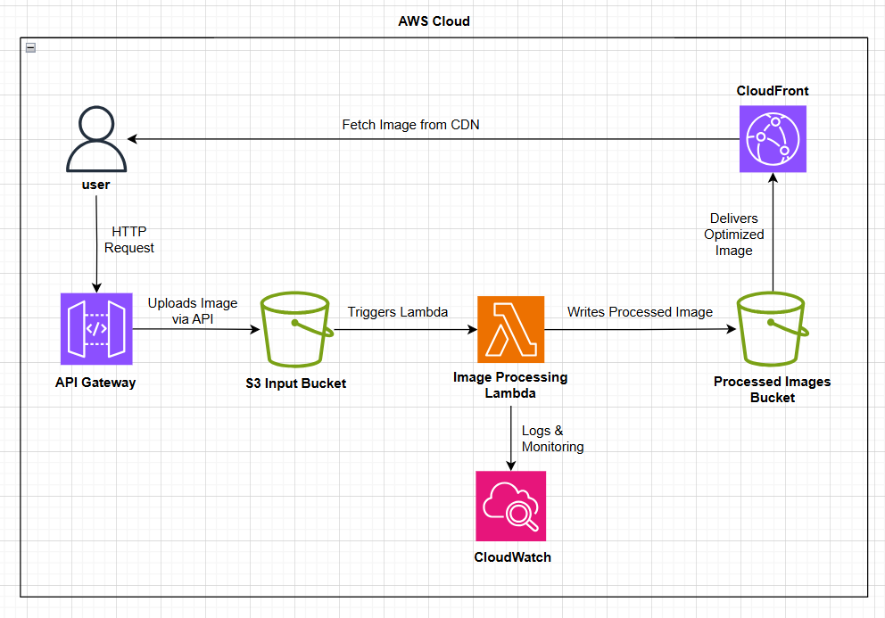

# Serverless Image Processing with AWS Lambda and S3

## Project Overview

هذا المشروع عبارة عن تطبيق لمعالجة الصور باستخدام الخدمات السحابية من AWS، بدون استخدام أي سيرفرات (Serverless).  
يعتمد التطبيق على رفع الصور إلى خدمة Amazon S3، حيث يتم تشغيل دالة AWS Lambda تلقائيًا عند رفع أي صورة، وتقوم هذه الدالة بمعالجة الصورة (مثل تغيير حجمها) وحفظ النسخة المعالجة في S3 Bucket آخر.

## Architecture Diagram

## AWS Services Used

- Amazon S3: لتخزين الصور الأصلية والنسخ المعالجة.
- AWS Lambda: لتنفيذ كود المعالجة تلقائيًا عند رفع الصور.
- IAM: للتحكم في صلاحيات الوصول بين Lambda وS3.
- Amazon CloudWatch: لمراقبة الأداء وتسجيل الأحداث.

(خدمات إضافية اختيارية يمكن استخدامها مثل API Gateway أو DynamoDB)

## How it Works

1. يقوم المستخدم برفع صورة إلى الـ S3 Bucket الرئيسي.
2. يتم تشغيل دالة Lambda تلقائيًا عند رفع الصورة.
3. تقوم Lambda بمعالجة الصورة (مثل تغيير الأبعاد).
4. يتم حفظ النسخة المعالجة في S3 Bucket مختلف.

## Setup Instructions

### المتطلبات الأساسية

- حساب AWS مفعل
- صلاحيات لإنشاء خدمات S3 وLambda وIAM
- Python 3 مثبت على جهازك

### خطوات التنفيذ

1. إنشاء Bucket أول باسم مثلاً `input-bucket`
2. إنشاء Bucket ثاني باسم مثلاً `output-bucket`
3. تجهيز كود Lambda باستخدام لغة Python ومكتبة Pillow
4. رفع الكود على AWS Lambda وربطه بـ input-bucket عن طريق Trigger
5. اختبار النظام عن طريق رفع صورة ومتابعة الناتج في Bucket الثاني

## Security

- يجب استخدام IAM Roles بصلاحيات محدودة فقط لما تحتاجه Lambda.
- يُفضل تفعيل S3 Bucket Policy لتقييد الوصول.
- يمكن مراجعة سجل الأحداث من خلال CloudWatch للتأكد من عدم وجود مشاكل.

## Cost Optimization

- المشروع يعتمد كليًا على خدمات Serverless والتي تقع ضمن الباقة المجانية AWS Free Tier.
- لا يتم استخدام خدمات مدفوعة مثل EC2 أو RDS.

## Learning Outcomes

- فهم كيفية إنشاء تطبيق Serverless باستخدام AWS.
- التعامل مع Event-driven Architecture عبر S3 Triggers.
- تنفيذ دوال Lambda واستخدام مكتبات Python مثل Pillow.
- تطبيق مفاهيم الأمان والتحكم في الصلاحيات داخل AWS.
